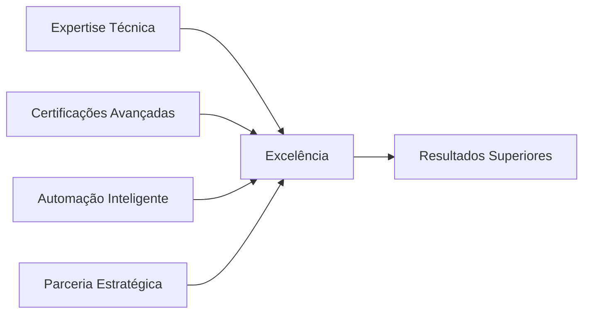
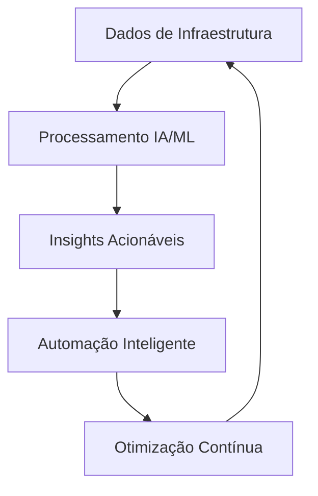
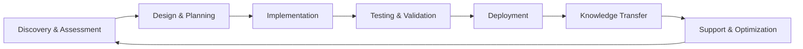
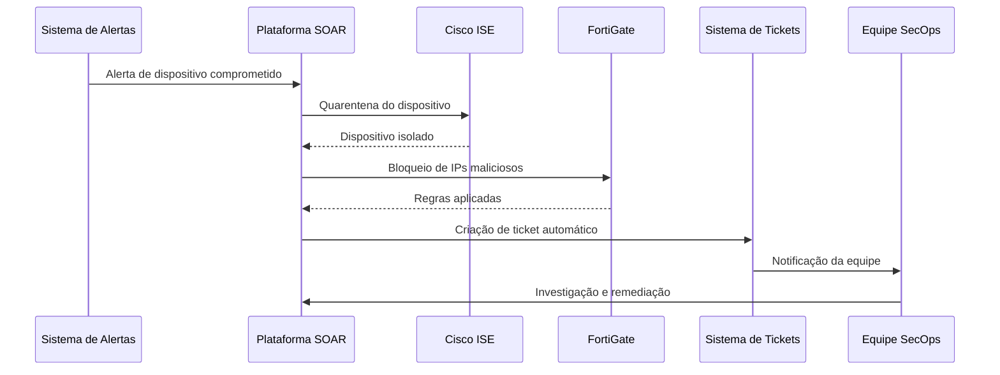

<div align="center">
  
# 🚀 BU ENGENHARIA - GPS IT


### **Soluções Enterprise em Redes, Segurança, Infraestrutura e Automação Inteligente**

*Transformando desafios complexos em soluções elegantes através de engenharia de excelência*

[Sobre Nós](#-sobre-a-bu-engenharia) • [Soluções](#-soluções-e-tecnologias) • [Equipe](#-nossa-equipe) • [Contato](#-contato)

</div>

---

## 📋 Índice

- [Sobre a BU Engenharia](#-sobre-a-bu-engenharia)
- [Soluções e Tecnologias](#-soluções-e-tecnologias)
  - [Cisco Solutions](#cisco-solutions)
  - [Fortinet Solutions](#fortinet-solutions)
- [Áreas de Especialização](#-áreas-de-especialização)
- [Nossa Equipe](#-nossa-equipe)
- [Certificações e Qualificações](#-certificações-e-qualificações)
- [Projetos em Destaque](#-projetos-em-destaque)
- [Metodologia](#-metodologia)
- [Stack Tecnológico](#-stack-tecnológico)
- [Casos de Uso](#-casos-de-uso)
- [Como Trabalhamos](#-como-trabalhamos)
- [Contato](#-contato)

---

## 🎯 Sobre a BU Engenharia

A **BU Engenharia da GPS IT** é um centro de excelência especializado em arquitetar, implementar e operar soluções corporativas de infraestrutura de rede, cibersegurança e automação inteligente. Combinamos expertise técnica de alta capacitação com as tecnologias mais avançadas do mercado para entregar resultados excepcionais.

### 🌟 Nossos Diferenciais



- **🎓 Profissionais Certificados**: Time com certificações CCNP e especializações avançadas
- **🤖 AI-Driven Operations**: Integração de Inteligência Artificial em todos os processos
- **🔐 Security-First Approach**: Segurança como fundamento de todas as soluções
- **⚡ Automação Avançada**: Orquestração e automação de ponta a ponta
- **🏗️ Infraestrutura Moderna**: Arquiteturas cloud-native e híbridas
- **📊 Observabilidade Total**: Monitoramento proativo com insights acionáveis

---

## 🛡️ Soluções e Tecnologias

### Cisco Solutions

Nossa expertise em soluções Cisco abrange todo o portfólio enterprise, com foco em segurança, identidade e automação de rede.

#### 🔐 **Cisco Identity Services Engine (ISE)**

<details>
<summary><b>Clique para expandir detalhes</b></summary>

**Controle de Acesso à Rede de Classe Mundial**

- ✅ **Policy-Based Access Control**: Implementação de políticas Zero Trust com segmentação dinâmica
- ✅ **802.1X Authentication**: Autenticação centralizada para dispositivos corporativos
- ✅ **Guest & BYOD Management**: Portais personalizados com onboarding automatizado
- ✅ **Profiling & Posture Assessment**: Identificação e validação de conformidade de endpoints
- ✅ **TrustSec Integration**: Segmentação baseada em tags (SGT/SXP) para micro-segmentação
- ✅ **Threat Intelligence**: Integração com pxGrid para resposta automatizada a ameaças
- ✅ **RADIUS AAA Services**: Serviços de autenticação, autorização e contabilização
- ✅ **Compliance Reporting**: Relatórios detalhados para auditorias e conformidade

**Casos de Uso:**
- Implementação de Zero Trust Network Access (ZTNA)
- Segmentação de rede por função, localização e risco
- Quarentena automatizada de dispositivos comprometidos
- Integração com SIEM/SOAR para resposta a incidentes

</details>

#### 🌐 **Cisco Web Security Appliance (WSA)**

<details>
<summary><b>Clique para expandir detalhes</b></summary>

**Proteção Avançada de Tráfego Web**

- ✅ **Advanced Malware Protection**: Bloqueio de malware em tempo real
- ✅ **URL Filtering & Categorization**: Controle granular de acesso web
- ✅ **Data Loss Prevention (DLP)**: Prevenção de vazamento de dados sensíveis
- ✅ **SSL/TLS Decryption**: Inspeção profunda de tráfego criptografado
- ✅ **Application Visibility & Control**: Controle de aplicações web e cloud
- ✅ **Reporting & Analytics**: Visibilidade completa do tráfego web
- ✅ **Policy Management**: Políticas centralizadas e hierárquicas

</details>

#### 🎛️ **Cisco Catalyst Center (DNA Center)**

<details>
<summary><b>Clique para expandir detalhes</b></summary>

**Automação e Orquestração de Rede Intent-Based**

- ✅ **Software-Defined Access (SDA)**: Fabric de rede automatizado com overlay VXLAN
- ✅ **Network Automation**: Provisionamento zero-touch e configuração declarativa
- ✅ **AI/ML Network Analytics**: Insights preditivos e detecção de anomalias
- ✅ **Assurance & Insights**: Monitoramento proativo com troubleshooting guiado
- ✅ **Policy-Based Segmentation**: Integração nativa com ISE para micro-segmentação
- ✅ **API-First Architecture**: Automação via REST APIs e Python SDK
- ✅ **Network Visibility**: Mapeamento automático de topologia e dispositivos
- ✅ **Compliance Management**: Validação automática de configurações e políticas

**Capacidades de Automação:**
```python
# Exemplo de automação com Catalyst Center SDK
from dnacentersdk import DNACenterAPI

api = DNACenterAPI(username="admin", password="password", base_url="https://catalyst-center.local")

# Deploy de configuração em escala
devices = api.devices.get_device_list()
template = api.configuration_templates.get_template_details(template_id="xxx")
api.configuration_templates.deploy_template(template_id="xxx", target_devices=devices)
```

</details>

#### 🔑 **Cisco Duo Security**

<details>
<summary><b>Clique para expandir detalhes</b></summary>

**Autenticação Multifator e Zero Trust Access**

- ✅ **Multi-Factor Authentication (MFA)**: Proteção de login com push, SMS, biometria
- ✅ **Single Sign-On (SSO)**: Acesso único para aplicações corporativas
- ✅ **Device Trust**: Validação de segurança de dispositivos
- ✅ **Adaptive Authentication**: MFA contextual baseado em risco
- ✅ **Remote Access Security**: Proteção de VPN e acesso remoto
- ✅ **Application Protection**: Integração com 100+ aplicações
- ✅ **Passwordless Authentication**: Autenticação sem senha com WebAuthn

</details>

#### 💻 **Cisco Secure Endpoint (AMP for Endpoints)**

<details>
<summary><b>Clique para expandir detalhes</b></summary>

**Proteção Avançada de Endpoints com IA**

- ✅ **AI-Powered Threat Detection**: Machine learning para detecção de ameaças
- ✅ **Retrospective Security**: Análise contínua de arquivos mesmo após execução
- ✅ **Behavioral Analysis**: Detecção de comportamentos maliciosos
- ✅ **Automated Threat Response**: Quarentena e remediação automatizadas
- ✅ **File Trajectory & Analysis**: Rastreamento completo de arquivos na rede
- ✅ **Vulnerability Assessment**: Identificação de vulnerabilidades em endpoints
- ✅ **Integration with SecureX**: Orquestração centralizada de segurança

</details>

#### ☂️ **Cisco Umbrella**

<details>
<summary><b>Clique para expandir detalhes</b></summary>

**Secure Internet Gateway na Nuvem**

- ✅ **DNS-Layer Security**: Primeira linha de defesa contra ameaças
- ✅ **Cloud-Delivered Firewall**: Firewall as a Service com controle de aplicações
- ✅ **Secure Web Gateway (SWG)**: Proteção completa de tráfego web
- ✅ **Cloud Access Security Broker (CASB)**: Controle de aplicações cloud
- ✅ **Threat Intelligence**: Integração com Talos para inteligência global
- ✅ **Remote User Protection**: Proteção para usuários em qualquer lugar
- ✅ **Reporting & Analytics**: Visibilidade completa de ameaças e uso

</details>

---

### Fortinet Solutions

Implementação e gestão de soluções Fortinet para segurança de perímetro, segmentação avançada e análise de segurança.

#### 🛡️ **FortiGate Next-Generation Firewall**

<details>
<summary><b>Clique para expandir detalhes</b></summary>

**Segurança de Rede de Alto Desempenho**

- ✅ **NGFW Capabilities**: Firewall de próxima geração com inspeção profunda
- ✅ **SD-WAN Integration**: Roteamento inteligente e otimização de WAN
- ✅ **Advanced Threat Protection**: IPS, antivirus, anti-malware integrados
- ✅ **SSL/TLS Inspection**: Inspeção de tráfego criptografado sem degradação
- ✅ **Application Control**: Visibilidade e controle de 5000+ aplicações
- ✅ **VPN Services**: IPsec e SSL VPN para acesso remoto seguro
- ✅ **Security Fabric Integration**: Orquestração com todo ecossistema Fortinet
- ✅ **High Availability**: Clustering ativo-ativo para resiliência
- ✅ **Virtual Domains (VDOMs)**: Segmentação lógica para multi-tenancy

**Arquiteturas Suportadas:**
- Segmentação de DMZ com múltiplas zonas
- SD-WAN multi-site com failover inteligente
- Security Fabric integrado com endpoints e cloud
- Implementações de alta disponibilidade e escalabilidade

</details>

#### 📊 **FortiAnalyzer**

<details>
<summary><b>Clique para expandir detalhes</b></summary>

**Analytics, Logging e Reporting Centralizado**

- ✅ **Centralized Logging**: Agregação de logs de toda infraestrutura Fortinet
- ✅ **Advanced Analytics**: Análise comportamental e detecção de anomalias
- ✅ **Custom Reports**: Relatórios personalizados para compliance e auditoria
- ✅ **Real-Time Monitoring**: Dashboards em tempo real com alertas
- ✅ **Threat Hunting**: Ferramentas avançadas para investigação de incidentes
- ✅ **Automation & Playbooks**: Resposta automatizada a eventos
- ✅ **Compliance Reporting**: Templates para PCI-DSS, LGPD, ISO 27001
- ✅ **Forensics & Investigation**: Análise forense detalhada de eventos
- ✅ **AI-Based Analytics**: Machine learning para detecção de ameaças

**Capacidades de Análise:**
- Análise de tráfego de rede e identificação de anomalias
- Correlação de eventos para detecção de ataques complexos
- Geração automática de relatórios executivos e técnicos
- Integração com SIEM para enriquecimento de contexto

</details>

#### 🔗 **FortiManager**

<details>
<summary><b>Clique para expandir detalhes</b></summary>

**Gestão Centralizada e Automação**

- ✅ **Centralized Management**: Gestão unificada de múltiplos FortiGates
- ✅ **Policy Management**: Políticas centralizadas com deployment automático
- ✅ **Configuration Templates**: Templates reutilizáveis para padronização
- ✅ **Firmware Management**: Atualizações coordenadas e seguras
- ✅ **API Automation**: Automação via REST API e Ansible
- ✅ **Zero-Touch Provisioning**: Provisionamento automático de novos sites

</details>

---

## 🎯 Áreas de Especialização

### 🔐 Cibersegurança Enterprise

```plaintext
┌─────────────────────────────────────────────────────────────┐
│                  SECURITY OPERATIONS CENTER                 │
├─────────────────────────────────────────────────────────────┤
│  🔍 Threat Detection     │  🛡️ Incident Response            │
│  🔐 Vulnerability Mgmt   │  📊 Security Analytics           │
│  🚨 SIEM/SOAR            │  🎯 Threat Hunting               │
│  📋 Compliance           │ 🔒 Zero Trust Architecture       │
└─────────────────────────────────────────────────────────────┘
```

**Serviços de SecOps:**

| Serviço | Descrição | Benefícios |
|---------|-----------|------------|
| **24x7 NOC** | Monitoramento contínuo de segurança | Detecção e resposta em tempo real |
| **Threat Intelligence** | Inteligência de ameaças contextualizada | Proteção proativa contra ameaças emergentes |
| **Incident Response** | Resposta rápida a incidentes | Minimização de impacto e tempo de recuperação |
| **Vulnerability Management** | Gestão contínua de vulnerabilidades | Redução da superfície de ataque |
| **Security Assessments** | Avaliações e auditorias de segurança | Identificação e mitigação de riscos |
| **Compliance Management** | Gestão de conformidade regulatória | Atendimento a LGPD, PCI-DSS, ISO 27001 |

### ⚙️ DevOps & Automação

**Práticas DevOps de Mercado:**

- 🔄 **CI/CD Pipelines**: GitLab CI, GitHub Actions, Jenkins
- 🐳 **Containerization**: Docker, Kubernetes, Podman
- 📦 **Infrastructure as Code**: Ansible, Puppet
- 🔧 **Configuration Management**: Ansible, Salt, Chef
- 📊 **Monitoring & Observability**: Prometheus, Grafana, Signoz
- 🚀 **GitOps**: ArgoCD, Flux para deployments declarativos

**Stack de Automação:**

```yaml
automation_stack:
  orchestration:
    - n8n (Low-code workflow automation)
    - Apache Airflow (Complex workflows)
    - Ansible Tower (Infrastructure automation)
  
  apis_integration:
    - REST APIs (Cisco, Fortinet, Cloud providers)
    - GraphQL (Modern data fetching)
    - Webhooks (Event-driven automation)
  
  scripting:
    - Python (Primary automation language)
    - Bash/Shell (System automation)
    - PowerShell (Windows automation)
    - JavaScript/Node.js (API integrations)
```

### 🤖 AIOps & Inteligência Artificial

**Operações Inteligentes Alimentadas por IA:**



**Capacidades AIOps:**

- 🧠 **Anomaly Detection**: ML para detecção de comportamentos anormais
- 📈 **Predictive Analytics**: Previsão de incidentes antes que ocorram
- 🤖 **Automated Remediation**: Correção automática de problemas comuns
- 💬 **AI-Powered Chatbots**: Assistentes inteligentes para operações
- 📊 **Root Cause Analysis**: Identificação automática de causas raiz
- 🎯 **Capacity Planning**: Otimização de recursos baseada em ML
- 🔮 **Forecasting**: Previsão de demanda e crescimento

**Tecnologias de IA Utilizadas:**

- 🐍 **Python Stack**: TensorFlow, PyTorch, Scikit-learn
- 🔗 **LLM Integration**: OpenAI GPT, Claude, Llama
- 📊 **MLOps**: MLflow, Kubeflow, Weights & Biases
- 🗣️ **NLP/NLU**: Processamento de linguagem natural para chatbots
- 📉 **Time Series Analysis**: Prophet, ARIMA para previsões

### 🏗️ Infraestrutura Moderna

**Arquiteturas Cloud-Native e Híbridas:**

```plaintext
╔════════════════════════════════════════════════════════════╗
║              MODERN INFRASTRUCTURE STACK                   ║
╠════════════════════════════════════════════════════════════╣
║  Cloud Platforms:    AWS | Azure | GCP                     ║
║  Hybrid Cloud:       VMware | Nutanix | OpenStack          ║
║  Container Platform: Kubernetes | Docker | Podman          ║
║  Service Mesh:       Istio | Linkerd | Consul              ║
║  Observability:      Prometheus | Grafana | Signoz         ║
║  CI/CD:              GitLab | GitHub Actions | ArgoCD      ║
╚════════════════════════════════════════════════════════════╝
```

---

## 👥 Nossa Equipe

### 🎓 Perfil Profissional

Nossa equipe é composta por **engenheiros seniores e especialistas** com profundo conhecimento técnico e experiência prática em ambientes enterprise de missão crítica.


### 🔬 Áreas de Expertise

| Especialidade              |   Nível    | Tecnologias Principais                       |
|----------------------------|------------|----------------------------------------------|
| **Network Engineering**    | Senior     | Cisco, Fortinet                              |
| **Security Engineering**   | Expert     | ISE, Duo, Umbrella, FortiGate, SIEM          |
| **DevOps Engineering**     | Senior     | Kubernetes, Docker, Ansible, CI/CD           |
| **SecOps Engineering**     | Expert     | SOAR, Threat Intelligence, Incident Response |
| **Cloud Architecture**     | Senior     | AWS, Azure, GCP, Multi-Cloud                 |
| **AIOps Engineering**      | Advanced   | Python, ML/AI, LLMs, Automation              |
| **Automation Engineering** | Expert     | Python, n8n, REST APIs, Scripting            |

---

## 🎯 Certificações e Qualificações

### 🏆 Parcerias Estratégicas

<div align="center">

| Parceiro | Status | Especializações |
|----------|--------|-----------------|
| **Cisco** | 🥇 Gold Partner | ISE, Catalyst Center, Security, SD-WAN |
| **Fortinet** | 🥈 Silver Partner | FortiGate, FortiAnalyzer, Security Fabric |
| **AWS** | ☁️ Select Partner | Cloud Security, Infrastructure |
| **Microsoft Azure** | ☁️ Partner | Hybrid Cloud, Security |

</div>

## 🔧 Metodologia

### Nosso Processo de Entrega



#### 1️⃣ **Discovery & Assessment**
- Análise profunda do ambiente atual
- Identificação de gaps e riscos
- Levantamento de requisitos técnicos e de negócio
- Definição de KPIs e objetivos mensuráveis

#### 2️⃣ **Design & Planning**
- Arquitetura de solução detalhada
- Projeto de baixo e alto nível (LLD/HLD)
- Planejamento de migração e rollback
- Definição de políticas e padrões

#### 3️⃣ **Implementation**
- Provisionamento de infraestrutura
- Configuração seguindo best practices
- Automação de tarefas repetitivas
- Documentação técnica detalhada

#### 4️⃣ **Testing & Validation**
- Testes funcionais e de performance
- Testes de segurança e penetração
- Validação de políticas e compliance
- Simulação de cenários de falha

#### 5️⃣ **Deployment**
- Implantação controlada e faseada
- Monitoramento em tempo real
- Validação pós-deployment
- Ajustes finos e otimizações

#### 6️⃣ **Knowledge Transfer**
- Treinamento hands-on para equipes
- Documentação de operação e troubleshooting
- Runbooks e playbooks
- Sessões de Q&A e workshops

#### 7️⃣ **Support & Optimization**
- Suporte contínuo 24x7
- Monitoramento proativo
- Otimização baseada em métricas
- Evolução contínua da solução

---

## 💻 Stack Tecnológico

### 🔧 Ferramentas de Automação e Orquestração

```yaml
automation_tools:
  workflow_orchestration:
    - n8n: "Low-code workflow automation platform"
    - Apache Airflow: "Complex data pipeline orchestration"
    - Prefect: "Modern workflow orchestration"
  
  configuration_management:
    - Ansible: "Agentless automation and orchestration"
    - Terraform: "Infrastructure as Code multi-cloud"
    - Puppet: "Configuration management at scale"
  
  api_integration:
    - Python Requests: "HTTP library for REST APIs"
    - FastAPI: "Modern Python API framework"
    - Postman: "API testing and development"
  
  chatbot_platforms:
    - Botpress Cloud: "Enterprise chatbot platform with AI"
    - Rasa: "Open-source conversational AI"
    - Microsoft Bot Framework: "Enterprise bot development"
```

### 🎨 Frontend & Desenvolvimento Web

```javascript
// Stack Moderno de Frontend
const techStack = {
  frameworks: {
    react: "^18.2.0",           // UI library with hooks
    nextjs: "^14.0.0",          // React framework with SSR
    vue: "^3.3.0",              // Progressive framework
    angular: "^17.0.0"          // Enterprise framework
  },
  
  styling: {
    tailwindcss: "^3.4.0",      // Utility-first CSS
    sass: "^1.69.0",            // CSS preprocessor
    styledComponents: "^6.1.0"  // CSS-in-JS
  },
  
  stateManagement: {
    redux: "@reduxjs/toolkit",
    zustand: "^4.4.0",
    recoil: "^0.7.0"
  },
  
  uiComponents: {
    materialui: "@mui/material",
    antd: "^5.12.0",
    shadcnui: "latest",
    chakraui: "@chakra-ui/react"
  },
  
  buildTools: {
    vite: "^5.0.0",             // Next-gen build tool
    webpack: "^5.89.0",
    esbuild: "^0.19.0"
  }
};
```

### 🐍 Backend & APIs

```python
# Stack Python/FastAPI para APIs e Backend
tech_stack = {
    "frameworks": {
        "fastapi": "0.108.0",      # Modern async API framework
        "django": "5.0",           # Full-featured web framework
        "flask": "3.0.0",          # Lightweight framework
        "pydantic": "2.5.0"        # Data validation
    },
    
    "async_tools": {
        "asyncio": "builtin",
        "aiohttp": "3.9.0",
        "httpx": "0.25.0",
        "uvicorn": "0.25.0"        # ASGI server
    },
    
    "database": {
        "sqlalchemy": "2.0",       # ORM
        "psycopg2": "2.9",         # PostgreSQL
        "motor": "3.3",            # Async MongoDB
        "redis": "5.0"             # Caching & queues
    },
    
    "automation": {
        "celery": "5.3",           # Distributed task queue
        "apache_airflow": "2.8",   # Workflow orchestration
        "requests": "2.31",        # HTTP library
        "pydantic": "2.5"          # Data validation
    },
    
    "ml_ai": {
        "tensorflow": "2.15",
        "pytorch": "2.1",
        "scikit-learn": "1.4",
        "transformers": "4.36",    # Hugging Face
        "langchain": "0.1",        # LLM applications
        "openai": "1.6"            # OpenAI API
    }
}
```

### 🔐 Segurança e Monitoramento

```yaml
security_monitoring_stack:
  siem_soar:
    - Splunk Enterprise Security
    - Greylog (Open Source SIEM)
    - Wazuh (Open Source SIEM)
  
  observability:
    - Prometheus: "Metrics collection"
    - Grafana: "Visualization and dashboards"
    - Loki: "Log aggregation"
    - Tempo: "Distributed tracing"
    - Zabbix: "Infrastructure monitoring"
  
  application_monitoring:
    - New Relic: "APM and observability"
    - Signoz: "Full-stack monitoring"
    - Dynatrace: "AI-powered monitoring"
  
  vulnerability_management:
    - Tenable Nessus: "Vulnerability scanning"
    - Qualys: "Cloud security assessment"
    - OpenVAS: "Open-source vulnerability scanner"
  
  devsecops:
    - SonarQube: "Code quality and security"
    - Snyk: "Container and dependency scanning"
    - GitLab Security: "Integrated security testing"
    - OWASP ZAP: "Security testing"
```

---

## 📊 Casos de Uso

### 🎯 Caso de Uso 1: Automação de Resposta a Incidentes



**Benefícios:**
- ⚡ Resposta em segundos vs. minutos
- 🎯 Isolamento automático de ameaças
- 📋 Documentação completa do incidente
- 🔄 Feedback loop para melhoria contínua

### 🎯 Caso de Uso 2: Onboarding Automatizado de Usuários

**Fluxo Automatizado:**

1. **Requisição**: Novo colaborador no RH
2. **Provisionamento**: Criação automática em:
   - Active Directory / Azure AD
   - Cisco ISE (perfil de acesso)
   - Duo (MFA enrollment)
   - Aplicações corporativas (via SSO)
3. **Configuração**: Políticas de segurança aplicadas
4. **Notificação**: Email de boas-vindas com credenciais
5. **Auditoria**: Log completo de todas as ações

**Tempo de Onboarding:**
- 📉 Manual: 4-6 horas
- ⚡ Automatizado: 15 minutos

### 🎯 Caso de Uso 3: Análise Preditiva de Capacidade

```python
# Exemplo de modelo preditivo para planejamento de capacidade
import pandas as pd
from sklearn.ensemble import RandomForestRegressor
from prophet import Prophet

class CapacityPredictor:
    def __init__(self):
        self.model = Prophet(yearly_seasonality=True)
    
    def predict_capacity(self, historical_data, forecast_days=30):
        """
        Prediz uso de recursos baseado em dados históricos
        """
        df = pd.DataFrame({
            'ds': historical_data['timestamp'],
            'y': historical_data['cpu_usage']
        })
        
        self.model.fit(df)
        future = self.model.make_future_dataframe(periods=forecast_days)
        forecast = self.model.predict(future)
        
        return forecast[['ds', 'yhat', 'yhat_lower', 'yhat_upper']]
```

---

## 🤝 Como Trabalhamos

### 📞 Modelos de Engajamento

#### 1. 🎯 **Projeto Turnkey**
Entrega completa de ponta a ponta com escopo fechado.

**Ideal para:**
- Implementações greenfield
- Migrações complexas
- Transformações de infraestrutura

#### 2. 🔧 **Managed Services**
Operação e suporte contínuo com SLA definido.

**Inclui:**
- Monitoramento 24x7 (NOC)
- Suporte técnico multi-nível
- Manutenção preventiva e corretiva
- Otimização contínua

#### 3. 💼 **Staff Augmentation**
Alocação de profissionais especializados no cliente.

**Perfis disponíveis:**
- Network Engineers 
- Security Engineers
  
#### 4. 🎓 **Consultoria & Assessment**
Avaliação técnica e recomendações estratégicas.

**Entregas:**
- Security Assessment Report
- Infrastructure Health Check
- POC/POV de soluções

---

### 📊 Dashboards e Reporting

Fornecemos dashboards executivos e técnicos com:

- 📈 **Métricas de Performance**: Uptime, latência, throughput
- 🔐 **Indicadores de Segurança**: Ameaças bloqueadas, vulnerabilidades, compliance
- 💰 **Business Metrics**: TCO, ROI, cost optimization
- 🎯 **SLA Tracking**: Disponibilidade, tempo de resposta, resolução
- 📊 **Capacity Planning**: Uso de recursos, previsões, recomendações

---

## 🎓 Treinamento e Capacitação

### 📚 Knowledge Transfer

Acreditamos que o sucesso do cliente depende da capacitação de suas equipes. Por isso, todos os nossos projetos incluem:

#### 🎯 **Treinamento Hands-On**
- Sessões práticas em ambiente real
- Laboratórios simulados para prática
- Cenários de troubleshooting reais

#### 📖 **Documentação Completa**
- Arquitetura e Design (HLD/LLD)
- Runbooks operacionais
- Playbooks de troubleshooting
- Procedimentos de manutenção

#### 🛠️ **Ferramentas e Scripts**
- Scripts de automação customizados
- Dashboards de monitoramento
- Ferramentas de troubleshooting
- Repositories no GitHub

---

## 🌟 Diferenciais Competitivos

### O que nos torna únicos:

```yaml
competitive_advantages:
  technical_excellence:
    - "Certificações de nível mundial (CCNP, NSE, CISSP)"
    - "Experiência hands-on em ambientes críticos"
    - "Continuous learning culture"
  
  innovation:
    - "AI/ML integrado em todas as soluções"
    - "Automação avançada com low-code + scripting"
    - "Research & Development contínuo"
  
  customer_focus:
    - "Resposta rápida (< 15min MTTR)"
    - "Suporte 24x7 em português"
    - "Proatividade na identificação de problemas"
  
  partnership:
    - "Relacionamento de longo prazo"
    - "Transparência e comunicação clara"
    - "Co-criação de soluções"
```

---

## 📬 Contato

### 🏢 GPS IT - BU Engenharia

**Canais de Atendimento:**

| Canal | Contato | Horário |
|-------|---------|---------|
| 📧 **Email** | comercial@gpsit.com.br | Comercial |
| 📞 **Telefone** | +55 (XX) XXXX-XXXX | Comercial |
| 🌐 **Website** | www.gpsit.com.br/   | - |
| 💼 **LinkedIn** | linkedin.com/company/gps-it | - |

### 📊 Solicite uma Avaliação

Interessado em nossas soluções? Entre em contato para:

- ✅ **Assessment** de infraestrutura e segurança
- ✅ **Workshop Técnico** sobre nossas soluções
- ✅ **POC/POV** de tecnologias específicas
- ✅ **Proposta Comercial** personalizada

---

## 📄 Licença e Propriedade Intelectual

© 2025 GPS IT - BU Engenharia. Todos os direitos reservados.

Este repositório contém informações proprietárias e confidenciais. O uso não autorizado de qualquer conteúdo deste repositório é estritamente proibido.

**Marcas Registradas:**
- Cisco®, Cisco ISE®, Catalyst®, Umbrella® são marcas registradas da Cisco Systems, Inc.
- Fortinet®, FortiGate®, FortiAnalyzer® são marcas registradas da Fortinet, Inc.
- Todas as outras marcas pertencem aos seus respectivos proprietários.

---

## 🎯 Call to Action

### Pronto para transformar sua infraestrutura?

```plaintext
┌─────────────────────────────────────────────────────────┐
│  🚀 Vamos construir o futuro da sua infraestrutura!     │
│                                                         │
│  Entre em contato hoje mesmo:                           │
│  📧 comercial@gpsit.com.br                              │
│  📞 +55 (XX) XXXX-XXXX                                  │
│                                                         │
│  ✨ Assessment gratuito para novos clientes             │
└─────────────────────────────────────────────────────────┘
```

---

<div align="center">

### ⭐ **Transformando Desafios em Soluções desde 2010** ⭐
 
**GPS IT - BU Engenharia - 2025**  
*Excelência Técnica • Inovação Contínua • Resultados Mensuráveis*

[](https://gpsit.com.br)
[](https://linkedin.com/company/gps-it)
[](mailto:engenharia@gpsit.com.br)

---

**Feito com ❤️ pela BU Engenharia da GPS IT**

</div>
